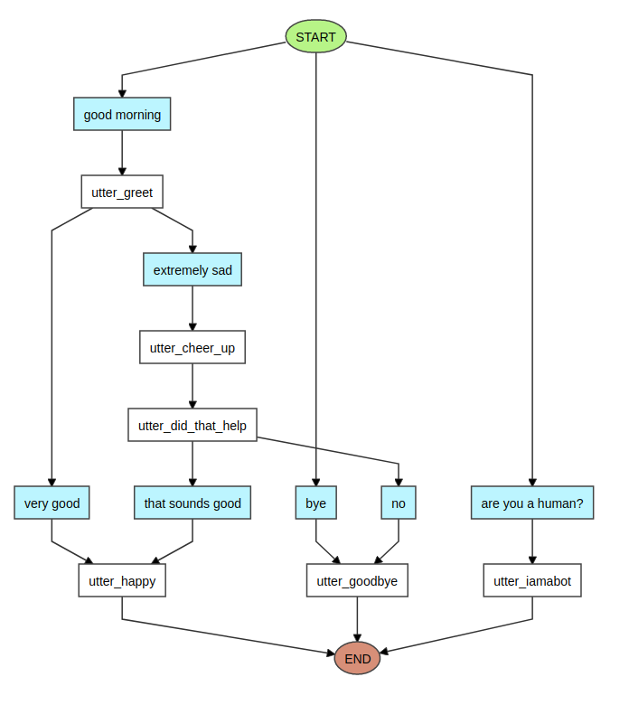

# Docker

Trying out Rasa with Docker

## Contents

The contents are as follows:

* [Verify Prerequisites](#verify-prerequisites)
    * [Check for the latest version of Rasa](#check-for-the-latest-version-of-rasa)
    * [Pull the Docker image](#pull-the-docker-image)
* [Create a project](#create-a-project)
    * [Inspect the default intents](#inspect-the-default-intents)
    * [Interact with the bot](#interact-with-the-bot)
    * [Inspect the default story](#inspect-the-default-story)
    * [Inspect the default domain](#inspect-the-default-domain)
    * [Create a visualization](#create-a-visualization)
* [To Do](#to-do)
* [Credits](#credits)

## Verify Prerequisites

Check for `docker` and `docker-compose`:

```bash
$ docker -v && docker-compose -v
Docker version 19.03.4, build 9013bf583a
docker-compose version 1.23.1, build b02f1306
$
```

#### Check for the latest version of Rasa

__1.4.2__ as per http://hub.docker.com/r/rasa/rasa/tags

#### Pull the Docker image

```bash
$ docker pull rasa/rasa:1.4.2
1.4.2: Pulling from rasa/rasa
8d691f585fa8: Pull complete
49bdb6f85638: Pull complete
73c12d19d464: Pull complete
9964ba7bfd8f: Pull complete
18a21a4ca4a0: Pull complete
d9072db337b5: Pull complete
8a377a815e92: Pull complete
dca83e7d804c: Pull complete
5310e3b991c6: Pull complete
e92acf81f819: Pull complete
1fd0e7fa4db2: Pull complete
Digest: sha256:bf70a20e4067c1afda970111c5dd44de0ea86aa3d21809e1b05002a91b9289e6
Status: Downloaded newer image for rasa/rasa:1.4.2
docker.io/rasa/rasa:1.4.2
$
```

## Create a project

```bash
$ mkdir app
$ chmod 777 app
$ docker run -v $(pwd)/app:/app --name rasa -it --rm rasa/rasa:1.4.2 init --no-prompt
Welcome to Rasa! 🤖

To get started quickly, an initial project will be created.
If you need some help, check out the documentation at https://rasa.com/docs/rasa.

Created project directory at '/app'.
Finished creating project structure.
Training an initial model...
Training Core model...
Processed Story Blocks: 100%|███████████████████████████████████████████████████████████████████████████████████████████████████████████████████████████████████████████████████████████████████████████████████| 5/5 [00:00<00:00, 4989.66it/s, # trackers=1]
Processed Story Blocks: 100%|███████████████████████████████████████████████████████████████████████████████████████████████████████████████████████████████████████████████████████████████████████████████████| 5/5 [00:00<00:00, 1602.35it/s, # trackers=5]
Processed Story Blocks: 100%|███████████████████████████████████████████████████████████████████████████████████████████████████████████████████████████████████████████████████████████████████████████████████| 5/5 [00:00<00:00, 357.98it/s, # trackers=20]
Processed Story Blocks: 100%|███████████████████████████████████████████████████████████████████████████████████████████████████████████████████████████████████████████████████████████████████████████████████| 5/5 [00:00<00:00, 248.58it/s, # trackers=24]
Processed trackers: 100%|███████████████████████████████████████████████████████████████████████████████████████████████████████████████████████████████████████████████████████████████████████████████████████| 5/5 [00:00<00:00, 4547.16it/s, # actions=16]
Processed actions: 16it [00:00, 13220.82it/s, # examples=16]
Processed trackers: 100%|██████████████████████████████████████████████████████████████████████████████████████████████████████████████████████████████████████████████████████████████████████████████████| 231/231 [00:00<00:00, 1980.78it/s, # actions=126]
Model: "sequential"
_________________________________________________________________
Layer (type)                 Output Shape              Param #   
=================================================================
masking (Masking)            (None, 5, 21)             0         
_________________________________________________________________
lstm (LSTM)                  (None, 32)                6912      
_________________________________________________________________
dense (Dense)                (None, 14)                462       
_________________________________________________________________
activation (Activation)      (None, 14)                0         
=================================================================
Total params: 7,374
Trainable params: 7,374
Non-trainable params: 0
_________________________________________________________________
2019-10-28 20:14:09 INFO     rasa.core.policies.keras_policy  - Fitting model with 126 total samples and a validation split of 0.1
Epoch 1/100
126/126 [==============================] - 0s 3ms/sample - loss: 2.6187 - acc: 0.1190
Epoch 2/100
126/126 [==============================] - 0s 80us/sample - loss: 2.5597 - acc: 0.2619
Epoch 3/100
126/126 [==============================] - 0s 66us/sample - loss: 2.5157 - acc: 0.3651
Epoch 4/100
126/126 [==============================] - 0s 83us/sample - loss: 2.4680 - acc: 0.4365
Epoch 5/100
126/126 [==============================] - 0s 64us/sample - loss: 2.4232 - acc: 0.4603
Epoch 6/100
126/126 [==============================] - 0s 64us/sample - loss: 2.3704 - acc: 0.4603
Epoch 7/100
126/126 [==============================] - 0s 84us/sample - loss: 2.3103 - acc: 0.4603
Epoch 8/100
126/126 [==============================] - 0s 65us/sample - loss: 2.2482 - acc: 0.4603
Epoch 9/100
126/126 [==============================] - 0s 64us/sample - loss: 2.1766 - acc: 0.4603
Epoch 10/100
126/126 [==============================] - 0s 94us/sample - loss: 2.1036 - acc: 0.4603
Epoch 11/100
126/126 [==============================] - 0s 74us/sample - loss: 2.0062 - acc: 0.4603
Epoch 12/100
126/126 [==============================] - 0s 67us/sample - loss: 1.9558 - acc: 0.4603
Epoch 13/100
126/126 [==============================] - 0s 67us/sample - loss: 1.8799 - acc: 0.4603
Epoch 14/100
126/126 [==============================] - 0s 83us/sample - loss: 1.8431 - acc: 0.4603
Epoch 15/100
126/126 [==============================] - 0s 65us/sample - loss: 1.7852 - acc: 0.4603
Epoch 16/100
126/126 [==============================] - 0s 65us/sample - loss: 1.7631 - acc: 0.4603
Epoch 17/100
126/126 [==============================] - 0s 65us/sample - loss: 1.7360 - acc: 0.4603
Epoch 18/100
126/126 [==============================] - 0s 82us/sample - loss: 1.7154 - acc: 0.4603
Epoch 19/100
126/126 [==============================] - 0s 65us/sample - loss: 1.6670 - acc: 0.4603
Epoch 20/100
126/126 [==============================] - 0s 65us/sample - loss: 1.6532 - acc: 0.4603
Epoch 21/100
126/126 [==============================] - 0s 90us/sample - loss: 1.6256 - acc: 0.4603
Epoch 22/100
126/126 [==============================] - 0s 65us/sample - loss: 1.6107 - acc: 0.4603
Epoch 23/100
126/126 [==============================] - 0s 64us/sample - loss: 1.6116 - acc: 0.4603
Epoch 24/100
126/126 [==============================] - 0s 67us/sample - loss: 1.5867 - acc: 0.4603
Epoch 25/100
126/126 [==============================] - 0s 78us/sample - loss: 1.5543 - acc: 0.4603
Epoch 26/100
126/126 [==============================] - 0s 66us/sample - loss: 1.5349 - acc: 0.4683
Epoch 27/100
126/126 [==============================] - 0s 64us/sample - loss: 1.5161 - acc: 0.4603
Epoch 28/100
126/126 [==============================] - 0s 80us/sample - loss: 1.5215 - acc: 0.4683
Epoch 29/100
126/126 [==============================] - 0s 64us/sample - loss: 1.4878 - acc: 0.4603
Epoch 30/100
126/126 [==============================] - 0s 64us/sample - loss: 1.4693 - acc: 0.4603
Epoch 31/100
126/126 [==============================] - 0s 84us/sample - loss: 1.4672 - acc: 0.4683
Epoch 32/100
126/126 [==============================] - 0s 70us/sample - loss: 1.4453 - acc: 0.4683
Epoch 33/100
126/126 [==============================] - 0s 66us/sample - loss: 1.4336 - acc: 0.4683
Epoch 34/100
126/126 [==============================] - 0s 64us/sample - loss: 1.4349 - acc: 0.4683
Epoch 35/100
126/126 [==============================] - 0s 86us/sample - loss: 1.4256 - acc: 0.4762
Epoch 36/100
126/126 [==============================] - 0s 64us/sample - loss: 1.3979 - acc: 0.4762
Epoch 37/100
126/126 [==============================] - 0s 65us/sample - loss: 1.3821 - acc: 0.4683
Epoch 38/100
126/126 [==============================] - 0s 88us/sample - loss: 1.3577 - acc: 0.4762
Epoch 39/100
126/126 [==============================] - 0s 64us/sample - loss: 1.3218 - acc: 0.4683
Epoch 40/100
126/126 [==============================] - 0s 65us/sample - loss: 1.3286 - acc: 0.4683
Epoch 41/100
126/126 [==============================] - 0s 77us/sample - loss: 1.2976 - acc: 0.4762
Epoch 42/100
126/126 [==============================] - 0s 72us/sample - loss: 1.2838 - acc: 0.4841
Epoch 43/100
126/126 [==============================] - 0s 66us/sample - loss: 1.2626 - acc: 0.4762
Epoch 44/100
126/126 [==============================] - 0s 65us/sample - loss: 1.2521 - acc: 0.4841
Epoch 45/100
126/126 [==============================] - 0s 78us/sample - loss: 1.2079 - acc: 0.5079
Epoch 46/100
126/126 [==============================] - 0s 64us/sample - loss: 1.2112 - acc: 0.5000
Epoch 47/100
126/126 [==============================] - 0s 65us/sample - loss: 1.1900 - acc: 0.5317
Epoch 48/100
126/126 [==============================] - 0s 81us/sample - loss: 1.1766 - acc: 0.5159
Epoch 49/100
126/126 [==============================] - 0s 66us/sample - loss: 1.1331 - acc: 0.5714
Epoch 50/100
126/126 [==============================] - 0s 65us/sample - loss: 1.1079 - acc: 0.5714
Epoch 51/100
126/126 [==============================] - 0s 64us/sample - loss: 1.1050 - acc: 0.5714
Epoch 52/100
126/126 [==============================] - 0s 80us/sample - loss: 1.0703 - acc: 0.5794
Epoch 53/100
126/126 [==============================] - 0s 64us/sample - loss: 1.0411 - acc: 0.6190
Epoch 54/100
126/126 [==============================] - 0s 64us/sample - loss: 1.0081 - acc: 0.6905
Epoch 55/100
126/126 [==============================] - 0s 82us/sample - loss: 1.0128 - acc: 0.6508
Epoch 56/100
126/126 [==============================] - 0s 65us/sample - loss: 0.9479 - acc: 0.7619
Epoch 57/100
126/126 [==============================] - 0s 63us/sample - loss: 0.9472 - acc: 0.7619
Epoch 58/100
126/126 [==============================] - 0s 64us/sample - loss: 0.9199 - acc: 0.7778
Epoch 59/100
126/126 [==============================] - 0s 94us/sample - loss: 0.8852 - acc: 0.8175
Epoch 60/100
126/126 [==============================] - 0s 65us/sample - loss: 0.8913 - acc: 0.7857
Epoch 61/100
126/126 [==============================] - 0s 65us/sample - loss: 0.8414 - acc: 0.8333
Epoch 62/100
126/126 [==============================] - 0s 86us/sample - loss: 0.8276 - acc: 0.8492
Epoch 63/100
126/126 [==============================] - 0s 66us/sample - loss: 0.7869 - acc: 0.8492
Epoch 64/100
126/126 [==============================] - 0s 63us/sample - loss: 0.8031 - acc: 0.8016
Epoch 65/100
126/126 [==============================] - 0s 78us/sample - loss: 0.7729 - acc: 0.8492
Epoch 66/100
126/126 [==============================] - 0s 65us/sample - loss: 0.7406 - acc: 0.8810
Epoch 67/100
126/126 [==============================] - 0s 68us/sample - loss: 0.7385 - acc: 0.8810
Epoch 68/100
126/126 [==============================] - 0s 63us/sample - loss: 0.7079 - acc: 0.8810
Epoch 69/100
126/126 [==============================] - 0s 75us/sample - loss: 0.7193 - acc: 0.8333
Epoch 70/100
126/126 [==============================] - 0s 66us/sample - loss: 0.7011 - acc: 0.8810
Epoch 71/100
126/126 [==============================] - 0s 66us/sample - loss: 0.7041 - acc: 0.8333
Epoch 72/100
126/126 [==============================] - 0s 82us/sample - loss: 0.6734 - acc: 0.8571
Epoch 73/100
126/126 [==============================] - 0s 67us/sample - loss: 0.6417 - acc: 0.8651
Epoch 74/100
126/126 [==============================] - 0s 66us/sample - loss: 0.6420 - acc: 0.8889
Epoch 75/100
126/126 [==============================] - 0s 79us/sample - loss: 0.6708 - acc: 0.8571
Epoch 76/100
126/126 [==============================] - 0s 68us/sample - loss: 0.6540 - acc: 0.8492
Epoch 77/100
126/126 [==============================] - 0s 66us/sample - loss: 0.6223 - acc: 0.8492
Epoch 78/100
126/126 [==============================] - 0s 65us/sample - loss: 0.6194 - acc: 0.8730
Epoch 79/100
126/126 [==============================] - 0s 87us/sample - loss: 0.5909 - acc: 0.8730
Epoch 80/100
126/126 [==============================] - 0s 64us/sample - loss: 0.5670 - acc: 0.9048
Epoch 81/100
126/126 [==============================] - 0s 67us/sample - loss: 0.5518 - acc: 0.8968
Epoch 82/100
126/126 [==============================] - 0s 82us/sample - loss: 0.5278 - acc: 0.9048
Epoch 83/100
126/126 [==============================] - 0s 68us/sample - loss: 0.5287 - acc: 0.9206
Epoch 84/100
126/126 [==============================] - 0s 73us/sample - loss: 0.5586 - acc: 0.8810
Epoch 85/100
126/126 [==============================] - 0s 64us/sample - loss: 0.5532 - acc: 0.8889
Epoch 86/100
126/126 [==============================] - 0s 86us/sample - loss: 0.5166 - acc: 0.9127
Epoch 87/100
126/126 [==============================] - 0s 66us/sample - loss: 0.5352 - acc: 0.8889
Epoch 88/100
126/126 [==============================] - 0s 64us/sample - loss: 0.5185 - acc: 0.8889
Epoch 89/100
126/126 [==============================] - 0s 88us/sample - loss: 0.5124 - acc: 0.8968
Epoch 90/100
126/126 [==============================] - 0s 66us/sample - loss: 0.4878 - acc: 0.9127
Epoch 91/100
126/126 [==============================] - 0s 64us/sample - loss: 0.4669 - acc: 0.9286
Epoch 92/100
126/126 [==============================] - 0s 78us/sample - loss: 0.4579 - acc: 0.9206
Epoch 93/100
126/126 [==============================] - 0s 66us/sample - loss: 0.5073 - acc: 0.8730
Epoch 94/100
126/126 [==============================] - 0s 67us/sample - loss: 0.4308 - acc: 0.9524
Epoch 95/100
126/126 [==============================] - 0s 68us/sample - loss: 0.4467 - acc: 0.9127
Epoch 96/100
126/126 [==============================] - 0s 91us/sample - loss: 0.4502 - acc: 0.9048
Epoch 97/100
126/126 [==============================] - 0s 64us/sample - loss: 0.4390 - acc: 0.9365
Epoch 98/100
126/126 [==============================] - 0s 66us/sample - loss: 0.4373 - acc: 0.9444
Epoch 99/100
126/126 [==============================] - 0s 84us/sample - loss: 0.4085 - acc: 0.9365
Epoch 100/100
126/126 [==============================] - 0s 66us/sample - loss: 0.4138 - acc: 0.9127
2019-10-28 20:14:11 INFO     rasa.core.policies.keras_policy  - Done fitting keras policy model
2019-10-28 20:14:11 INFO     rasa.core.agent  - Persisted model to '/tmp/tmpzb41eyv7/core'
Core model training completed.
Training NLU model...
2019-10-28 20:14:11 INFO     rasa.nlu.training_data.training_data  - Training data stats:
	- intent examples: 43 (7 distinct intents)
	- Found intents: 'goodbye', 'greet', 'mood_unhappy', 'mood_great', 'affirm', 'deny', 'bot_challenge'
	- Number of response examples: 0 (0 distinct response)
	- entity examples: 0 (0 distinct entities)
	- found entities:

2019-10-28 20:14:11 INFO     rasa.nlu.model  - Starting to train component WhitespaceTokenizer
2019-10-28 20:14:11 INFO     rasa.nlu.model  - Finished training component.
2019-10-28 20:14:11 INFO     rasa.nlu.model  - Starting to train component RegexFeaturizer
2019-10-28 20:14:11 INFO     rasa.nlu.model  - Finished training component.
2019-10-28 20:14:11 INFO     rasa.nlu.model  - Starting to train component CRFEntityExtractor
2019-10-28 20:14:11 INFO     rasa.nlu.model  - Finished training component.
2019-10-28 20:14:11 INFO     rasa.nlu.model  - Starting to train component EntitySynonymMapper
2019-10-28 20:14:11 INFO     rasa.nlu.model  - Finished training component.
2019-10-28 20:14:11 INFO     rasa.nlu.model  - Starting to train component CountVectorsFeaturizer
2019-10-28 20:14:11 INFO     rasa.nlu.model  - Finished training component.
2019-10-28 20:14:11 INFO     rasa.nlu.model  - Starting to train component CountVectorsFeaturizer
2019-10-28 20:14:11 INFO     rasa.nlu.model  - Finished training component.
2019-10-28 20:14:11 INFO     rasa.nlu.model  - Starting to train component EmbeddingIntentClassifier
Epochs: 100%|███████████████████████████████████████████████████████████████████████████████████████████████████████████████████████████████████████████████████████████████████████████████████████| 300/300 [00:02<00:00, 145.34it/s, loss=0.464, acc=1.000]
2019-10-28 20:14:15 INFO     rasa.utils.train_utils  - Finished training embedding policy, train loss=0.464, train accuracy=1.000
2019-10-28 20:14:15 INFO     rasa.nlu.model  - Finished training component.
2019-10-28 20:14:15 INFO     rasa.nlu.model  - Successfully saved model into '/tmp/tmpzb41eyv7/nlu'
NLU model training completed.
Your Rasa model is trained and saved at '/app/models/20191028-201405.tar.gz'.
If you want to speak to the assistant, run 'rasa shell' at any time inside the project directory.
$
```

[Note that, by default, `rasa` trained and saved the model.]

#### Inspect the default intents

```bash
$ cat app/data/nlu.md
## intent:greet
- hey
- hello
- hi
- good morning
- good evening
- hey there

## intent:goodbye
- bye
- goodbye
- see you around
- see you later

## intent:affirm
- yes
- indeed
- of course
- that sounds good
- correct

## intent:deny
- no
- never
- I don't think so
- don't like that
- no way
- not really

## intent:mood_great
- perfect
- very good
- great
- amazing
- wonderful
- I am feeling very good
- I am great
- I'm good

## intent:mood_unhappy
- sad
- very sad
- unhappy
- bad
- very bad
- awful
- terrible
- not very good
- extremely sad
- so sad

## intent:bot_challenge
- are you a bot?
- are you a human?
- am I talking to a bot?
- am I talking to a human?
$
```

#### Interact with the bot

Lets see how it deals with imperfect data:

```bash
$ docker run -v $(pwd)/app:/app --name rasa -it --rm rasa/rasa:1.4.2 shell
2019-10-28 20:34:18 INFO     root  - Connecting to channel 'cmdline' which was specified by the '--connector' argument. Any other channels will be ignored. To connect to all given channels, omit the '--connector' argument.
2019-10-28 20:34:18 INFO     root  - Starting Rasa server on http://localhost:5005
Bot loaded. Type a message and press enter (use '/stop' to exit):
Your input ->  heya                                                                                                                                                                                                                                           
Hey! How are you?
Your input ->  drizzly                                                                                                                                                                                                                                        
Here is something to cheer you up:
Image: https://i.imgur.com/nGF1K8f.jpg
Did that help you?
Your input ->  Grr!                                                                                                                                                                                                                                           
Bye
Your input ->  /stop                                                                                                                                                                                                                                          
2019-10-28 20:35:42 INFO     root  - Killing Sanic server now.
$
```

Close enough!

#### Inspect the default story

___Stories___ are where Rasa really starts to shine.

Lets look at our default story:

```bash
$ cat app/data/stories.md
## happy path
* greet
  - utter_greet
* mood_great
  - utter_happy

## sad path 1
* greet
  - utter_greet
* mood_unhappy
  - utter_cheer_up
  - utter_did_that_help
* affirm
  - utter_happy

## sad path 2
* greet
  - utter_greet
* mood_unhappy
  - utter_cheer_up
  - utter_did_that_help
* deny
  - utter_goodbye

## say goodbye
* goodbye
  - utter_goodbye

## bot challenge
* bot_challenge
  - utter_iamabot
$
```

#### Inspect the default domain

Finally, lets have a look at our default domain:

```bash
$ cat app/domain.yml
intents:
  - greet
  - goodbye
  - affirm
  - deny
  - mood_great
  - mood_unhappy
  - bot_challenge

actions:
- utter_greet
- utter_cheer_up
- utter_did_that_help
- utter_happy
- utter_goodbye
- utter_iamabot

templates:
  utter_greet:
  - text: "Hey! How are you?"

  utter_cheer_up:
  - text: "Here is something to cheer you up:"
    image: "https://i.imgur.com/nGF1K8f.jpg"

  utter_did_that_help:
  - text: "Did that help you?"

  utter_happy:
  - text: "Great, carry on!"

  utter_goodbye:
  - text: "Bye"

  utter_iamabot:
  - text: "I am a bot, powered by Rasa."
$
```

#### Create a visualization

Finally, lets create a visualization:

```bash
$ docker run -v $(pwd)/app:/app --name rasa -it --rm rasa/rasa:1.4.2 visualize
2019-11-05 19:08:30 INFO     rasa.core.visualize  - Starting to visualize stories...
Processed Story Blocks: 100%|███████████████████████████████████████████████████████████████████████████████████████████████████████████████████████████████████████████████████████████████████████████████████| 5/5 [00:00<00:00, 5244.19it/s, # trackers=1]
2019-11-05 19:08:30 INFO     rasa.core.visualize  - Finished graph creation. Saved into file:///app/graph.html
$
```

If we open file:///app/graph.html in a browser, it should look as follows:



## To Do

- [ ] Train a Rasa Model
- [ ] Investigate Rasa's [Training Data Format](http://rasa.com/docs/rasa/nlu/training-data-format/)
- [ ] Investigate Rasa's [Custom Actions](http://rasa.com/docs/rasa/core/actions/#custom-actions)
- [ ] Investigate Rasa's [Pipelines](http://rasa.com/docs/rasa/nlu/choosing-a-pipeline/)
- [ ] Write a custom [Tracker Store](http://rasa.com/docs/rasa/api/tracker-stores/)

## Credits

Running Rasa with Docker:

    http://rasa.com/docs/rasa/user-guide/running-rasa-with-docker/
